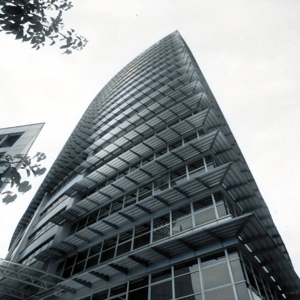

# Image Denoising Application

A Streamlit-based application for automatic noise detection and image denoising using pre-trained TensorFlow models.

## Features
- Automatic noise type classification (Gaussian, Speckle, Salt and Pepper, Poisson, Multiplicative, JPEG, Quantization)
- Patch-based denoising for handling large images efficiently
- Manual noise type selection option
- Performance metrics: PSNR and SSIM calculation
- CPU-only execution (no GPU required)

## Demo

🎥 **[Watch Demo Video](demo.mp4)**  
🖼️ Below are sample images showing the noise detection and denoising process:

| Noisy Image | Denoised Image |
|------------|----------------|
|  |  |

> *These results demonstrate how the model detects the correct noise type and applies an optimal denoising model.*

## Prerequisites
- Python 3.11
- Windows 10 (tested) or any OS with Python 3.11
- CPU-only environment

## Installation
1. Clone this repository:
   ```powershell
   git clone https://github.com/danyQe/image-denoiser.git
   cd image-denoiser
```

2. Create and activate a virtual environment:

   ```powershell
   python -m venv .venv
   .\.venv\Scripts\Activate.ps1
   ```
3. Install required packages:

   ```powershell
   pip install -r requirements.txt
   ```

   If you don't have a `requirements.txt`, install manually:

   ```powershell
   pip install streamlit opencv-python-headless numpy tensorflow keras keras-hub scikit-image
   ```

## Models

Models will be downloaded automatically from the KaggleHub API.

## Usage

1. Run the Streamlit app:

   ```powershell
   streamlit run app.py
   ```
2. In the web interface:

   * Upload an image (JPEG or PNG).
   * (Optional) Check "Manual noise selection" and choose noise types.
   * Click "Denoise Image".
   * View the original and denoised images side by side.
   * Review detected or applied noise types and PSNR/SSIM metrics.

## Project Structure

```
.
├── app.py
├── demo.mp4
├── noisy_image.jpg
├── denoised_image.jpg
├── requirements.txt
└── README.md
```

## License

This project is licensed under the MIT License.

